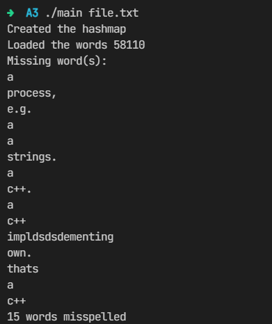

**Table of Content**
- [Spell Checker](#spell-checker)
  - [Abstract](#abstract)
  - [Data Structure used](#data-structure-used)
  - [Usage](#usage)
  - [Setup](#setup)
  - [Demo](#demo)

<br/>

# Spell Checker

## Abstract
This application is written in C++ and is a spell check library. It has a word list of around 58K unique words. Given an input file it scans the file and checks each word to see if it's correctly spelled and at the end prints all the misspelled words.

## Data Structure used
It uses a Hash Table to store the words. The hash table is initially loaded with all the words and later it's checked for misspelled words. 
As the the collision resolution, it uses chaining method to resolve the collisions if any. 

## Usage
```bash
  ./main <input file to check>
```

## Setup
```bash
  git clone https://github.com/ShaderOX/Spell-Checker
  cd Spell-Checker
  make
```

## Demo


